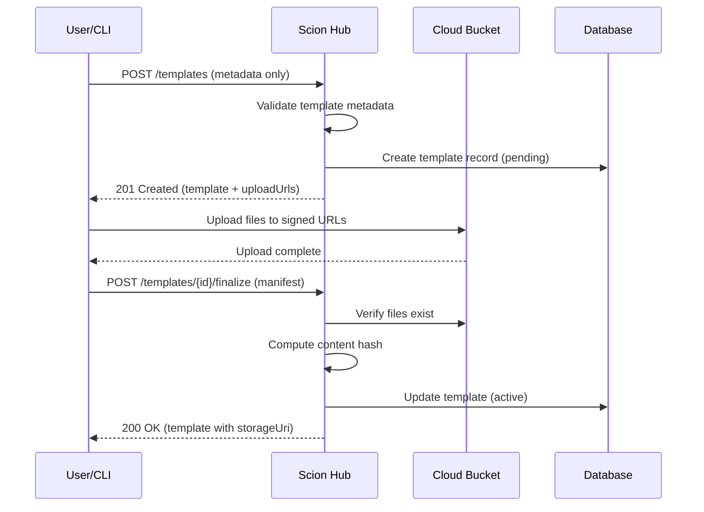
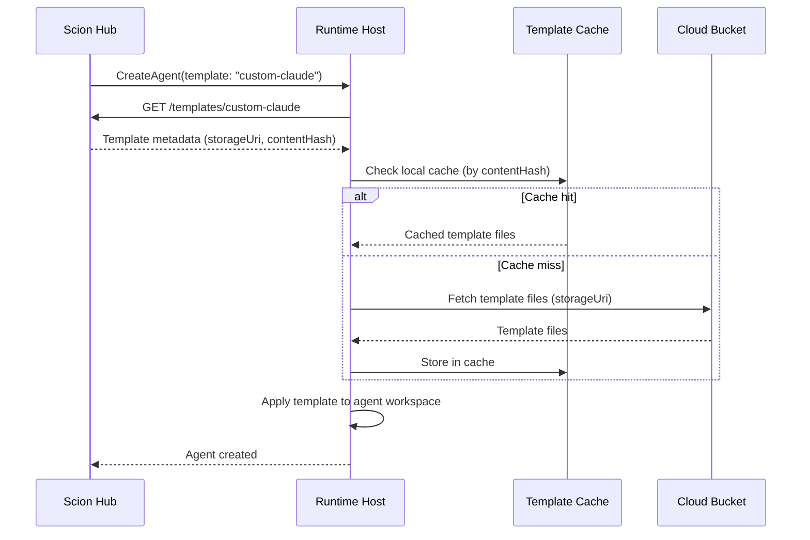

# Hosted Template Management Design

## Status
**In Progress** (Phase 2 Complete)

## 1. Overview

This document specifies the design for managing agent templates in the hosted Scion architecture. In the hosted model, templates are stored in cloud storage (buckets) and registered with the Hub for discovery, access control, and distribution to Runtime Hosts.

### 1.1. Current Template System (Solo Mode)

In solo mode, templates are:
- **Embedded in binary:** Default templates (claude, gemini, codex, opencode) are compiled into the `scion` binary via `//go:embed`
- **Seeded on init:** `scion init` copies templates to `.scion/templates/` in the grove
- **Locally stored:** Each grove maintains its own template copies on the filesystem
- **Resolved at agent creation:** The Runtime Host reads template files from disk when starting an agent
- **URI-based remote templates:** Solo mode already supports referencing templates via URIs to remote locations; this capability remains independent of Hub-based template management

### 1.2. Hosted Template Requirements

The hosted architecture introduces new requirements:
- **Centralized registry:** Templates must be discoverable across distributed Runtime Hosts
- **Scope hierarchy:** Templates can be global (platform-wide), grove-scoped, or user-scoped
- **Cloud storage:** Template files must be stored durably in buckets, not just local filesystems
- **Hydration on demand:** Runtime Hosts must fetch templates from storage when creating agents
- **Change tracking:** Templates track when and by whom they were last modified
- **Access control:** Template visibility and modification rights must respect ownership (deferred to comprehensive access control design)

### 1.3. Key Design Decisions

| Decision | Choice | Rationale |
|----------|--------|-----------|
| Storage backend | Hub storage bucket with `/templates` prefix | Durable, scalable; templates share bucket with other Hub data |
| Registry | Hub database | Centralized metadata, search, access control |
| Distribution | Pull-based (Host fetches from bucket) | Simpler than push; works across NAT/firewalls |
| Caching | Local cache on Runtime Hosts | Avoid re-fetching unchanged templates |
| Content hashing | SHA-256 hash of contents | Reliable cache invalidation |
| Versioning | Deferred | GCS native versioning available for future use |

---

## 2. Architecture

### 2.1. Component Responsibilities

The Hub maintains a general storage bucket for all cloud storage needs. Templates are stored under a `/templates` prefix within this bucket.

```
                                    ┌──────────────────────────────────────┐
                                    │            Hub Storage Bucket        │
                                    │  (GCS/S3/Azure Blob)                │
                                    │                                      │
                                    │  gs://scion-hub-{env}/               │
                                    │    └── templates/                    │
                                    │        ├── global/                   │
                                    │        │   └── claude/...           │
                                    │        ├── groves/{groveId}/        │
                                    │        │   └── custom-claude/...    │
                                    │        └── users/{userId}/          │
                                    │            └── my-template/...      │
                                    └──────────────┬───────────────────────┘
                                                   │
                           ┌───────────────────────┼───────────────────────┐
                           │                       │                       │
                           ▼                       │                       ▼
                    ┌─────────────┐                │              ┌─────────────────┐
                    │   Scion     │                │              │  Runtime Host   │
                    │   Hub       │◄───────────────┘              │                 │
                    │             │                               │  ┌───────────┐  │
                    │  Template   │  1. Register template         │  │  Template │  │
                    │  Registry   │◄──────────────────────────────│  │   Cache   │  │
                    │  (Metadata) │                               │  └───────────┘  │
                    │             │  2. List/Get templates        │                 │
                    │             │────────────────────────────►  │  3. Fetch from  │
                    │             │                               │     bucket      │
                    └─────────────┘                               └─────────────────┘
```

### 2.2. Data Flow: Template Upload

Template creation uses a two-phase approach: metadata registration followed by file upload via signed URLs.



### 2.3. Data Flow: Agent Creation with Template



---

## 3. Template Scope Hierarchy

Templates exist at three scope levels, with resolution following a defined precedence order.

### 3.1. Scope Definitions

| Scope | Description | Storage Path | Visibility |
|-------|-------------|--------------|------------|
| **Global** | Platform-provided defaults | `gs://.../templates/global/{templateName}/` | All users |
| **Grove** | Project-specific customizations | `gs://.../templates/groves/{groveId}/{templateName}/` | Grove members |
| **User** | Personal templates | `gs://.../templates/users/{userId}/{templateName}/` | Owner only (or shared) |

### 3.2. Template Resolution Order

When an agent specifies a template name without explicit scope, resolution follows:

1. **Grove scope:** Check if grove has a template with this name
2. **User scope:** Check if the requesting user has a personal template with this name
3. **Global scope:** Fall back to global template

This allows groves to override global defaults and users to have personal variations.

### 3.3. Explicit Scope Reference

Templates can be referenced with explicit scope using prefixes:

```
global:claude          # Explicit global template
grove:custom-claude    # Explicit grove template (current grove)
user:my-claude         # Explicit user template
grove:{groveId}:custom # Template from a specific grove
```

---

## 4. Data Model

### 4.1. Template Record (Hub Database)

```json
{
  "id": "uuid",                    // Primary identifier
  "name": "string",                // Template name (e.g., "claude", "custom-gemini")
  "slug": "string",                // URL-safe identifier
  "displayName": "string",         // Human-friendly name
  "description": "string",         // Optional description

  "harness": "string",             // Harness type: claude, gemini, codex, opencode, generic
  "contentHash": "string",         // SHA-256 hash of template contents

  "scope": "string",               // global, grove, user
  "scopeId": "string",             // groveId or userId (null for global)

  "storageUri": "string",          // Full bucket URI (e.g., "gs://bucket/templates/path/")
  "storageBucket": "string",       // Bucket name
  "storagePath": "string",         // Path within bucket

  "config": {                      // Default agent configuration
    "image": "string",             // Default container image
    "env": {"key": "value"},       // Default environment variables
    "commandArgs": ["string"],     // Default command arguments
    "model": "string",             // Default model
    "kubernetes": "KubernetesConfig"
  },

  "files": [                       // Manifest of template files
    {
      "path": "string",            // Relative path (e.g., "home/.bashrc")
      "size": 1024,                // File size in bytes
      "hash": "string",            // SHA-256 hash of file
      "mode": "0644"               // File permissions
    }
  ],

  "baseTemplate": "string",        // Parent template ID (for inheritance)
  "locked": false,                 // Prevent modifications (global templates)

  "visibility": "string",          // private, grove, public
  "ownerId": "string",             // User ID who owns this
  "createdBy": "string",           // User ID who created this
  "created": "2025-01-24T10:00:00Z",
  "updated": "2025-01-24T10:30:00Z",
  "updatedBy": "string",           // User ID who last updated this

  "status": "string"               // active, archived
}
```

### 4.2. Template File Structure

Template files follow a consistent structure in storage:

```
{storageUri}/
├── manifest.json          # File manifest with hashes
├── scion-agent.yaml       # Harness configuration
├── home/
│   ├── .bashrc           # Shell initialization
│   ├── .tmux.conf        # Tmux configuration
│   └── {configDir}/      # Harness-specific config
│       ├── settings.json
│       ├── system_prompt.md
│       └── CLAUDE.md (or equivalent)
└── workspace/             # Optional workspace files
    └── .gitignore
```

### 4.3. Manifest File Format

The manifest provides content-addressable verification:

```json
{
  "version": "1.0",
  "created": "2025-01-24T10:00:00Z",
  "harness": "claude",
  "files": [
    {
      "path": "scion-agent.yaml",
      "hash": "sha256:abc123...",
      "size": 256,
      "mode": "0644"
    },
    {
      "path": "home/.bashrc",
      "hash": "sha256:def456...",
      "size": 1024,
      "mode": "0644"
    }
  ],
  "contentHash": "sha256:xyz789..."
}
```

The `contentHash` is computed by hashing the concatenation of all file hashes in sorted path order.

---

## 5. Hub API Extensions

### 5.1. Template Endpoints

The Hub API (see `hub-api.md` Section 6) is extended with additional operations for hosted template management.

#### List Templates

```
GET /api/v1/templates
```

**Query Parameters:**
| Parameter | Type | Description |
|-----------|------|-------------|
| `scope` | string | Filter by scope (global, grove, user) |
| `groveId` | string | Filter by grove (required for grove scope) |
| `harness` | string | Filter by harness type |
| `status` | string | Filter by status (active, archived) |
| `search` | string | Full-text search on name/description |
| `limit` | int | Maximum results (default: 50) |
| `cursor` | string | Pagination cursor |

**Response:**
```json
{
  "templates": ["Template"],
  "nextCursor": "string",
  "totalCount": 100
}
```

#### Get Template

```
GET /api/v1/templates/{templateId}
```

**Response:** Template record with full metadata.

#### Create Template

```
POST /api/v1/templates
```

**Request Body:**
```json
{
  "name": "string",                // Required
  "displayName": "string",         // Optional, defaults to name
  "description": "string",         // Optional
  "harness": "string",             // Required: claude, gemini, etc.

  "scope": "grove",                // global (admin only), grove, user
  "groveId": "string",             // Required for grove scope

  "config": {                      // Optional default config
    "image": "string",
    "env": {"key": "value"},
    "model": "string"
  },

  "baseTemplate": "string",        // Optional: inherit from existing template
  "visibility": "private"          // private, grove, public
}
```

**Response:** `201 Created`
```json
{
  "template": "Template",
  "uploadUrls": [
    {
      "path": "scion-agent.yaml",
      "url": "https://storage.googleapis.com/...",
      "expires": "2025-01-24T11:00:00Z"
    }
  ],
  "manifestUrl": "string"
}
```

#### Upload Template Files

Template files are uploaded directly to cloud storage using signed URLs.

**Step 1: Request upload URLs (if not received from create)**
```
POST /api/v1/templates/{templateId}/upload
```

**Request Body:**
```json
{
  "files": [
    {"path": "scion-agent.yaml", "size": 256},
    {"path": "home/.bashrc", "size": 1024}
  ]
}
```

**Response:**
```json
{
  "uploadUrls": [
    {
      "path": "scion-agent.yaml",
      "url": "https://storage.googleapis.com/...",
      "expires": "2025-01-24T11:00:00Z"
    }
  ],
  "manifestUrl": "string"
}
```

**Step 2: Upload files to signed URLs**

Client uploads each file directly to the provided URLs.

**Step 3: Finalize upload**
```
POST /api/v1/templates/{templateId}/finalize
```

**Request Body:**
```json
{
  "manifest": {
    "version": "1.0",
    "files": [
      {"path": "scion-agent.yaml", "hash": "sha256:...", "size": 256, "mode": "0644"}
    ]
  }
}
```

Hub verifies uploaded files match manifest, computes contentHash, and marks template as active.

#### Update Template

```
PUT /api/v1/templates/{templateId}
```

Updates template metadata and/or files. This is an upsert-style operation that can handle both metadata updates and file re-uploads in a single flow.

**Request Body:**
```json
{
  "displayName": "string",
  "description": "string",
  "config": {},
  "visibility": "string",
  "files": [                       // Optional: include to update files
    {"path": "scion-agent.yaml", "size": 256}
  ]
}
```

**Response:** If `files` is included, returns upload URLs; otherwise returns updated template.

#### Delete Template

```
DELETE /api/v1/templates/{templateId}
```

**Query Parameters:**
| Parameter | Type | Description |
|-----------|------|-------------|
| `deleteFiles` | bool | Also delete files from storage (default: false) |
| `force` | bool | Delete even if agents reference this template |

Soft-delete by default (sets status to archived). With `deleteFiles=true`, removes from storage.

#### Rename Template

```
PATCH /api/v1/templates/{templateId}
```

**Request Body:**
```json
{
  "name": "new-name",
  "slug": "new-slug"               // Optional, auto-generated if omitted
}
```

Note: Renaming does not affect existing agents using the template (they reference by ID).

#### Clone Template

```
POST /api/v1/templates/{templateId}/clone
```

Creates a copy of a template, optionally into a different scope.

**Request Body:**
```json
{
  "name": "my-custom-claude",
  "scope": "grove",
  "groveId": "grove-xyz",
  "visibility": "grove"
}
```

**Response:** New template with files copied to new storage location.

#### Download Template

```
GET /api/v1/templates/{templateId}/download
```

Returns signed URLs for downloading template files.

**Response:**
```json
{
  "manifestUrl": "string",
  "files": [
    {
      "path": "scion-agent.yaml",
      "url": "https://storage.googleapis.com/...",
      "size": 256,
      "hash": "sha256:..."
    }
  ],
  "expires": "2025-01-24T11:00:00Z"
}
```

---

## 6. Storage Architecture

### 6.1. Bucket Structure

Templates are stored under the `/templates` prefix within the Hub's general storage bucket:

```
gs://scion-hub-{env}/
└── templates/
    ├── global/
    │   ├── claude/
    │   │   ├── manifest.json
    │   │   ├── scion-agent.yaml
    │   │   └── home/...
    │   └── gemini/
    │       └── ...
    ├── groves/
    │   └── {groveId}/
    │       └── {templateName}/
    │           └── ...
    └── users/
        └── {userId}/
            └── {templateName}/
                └── ...
```

### 6.2. Storage Path Components

| Component | Format | Example |
|-----------|--------|---------|
| Bucket | `scion-hub-{env}` | `scion-hub-prod` |
| Prefix | `templates/` | `templates/` |
| Scope prefix | `global/`, `groves/{id}/`, `users/{id}/` | `groves/abc123/` |
| Template name | Slug-safe name | `custom-claude` |

### 6.3. Hub Storage Configuration

The Hub uses a single storage bucket for all cloud storage needs. Templates are stored under a hardcoded `/templates` prefix.

```yaml
hub:
  storage:
    provider: "gcs"              # gcs, s3, azure
    bucket: "scion-hub-prod"
    region: "us-central1"
```

Signed URL expiry is managed internally as a code constant (not configurable). Lifecycle policies (archival, deletion) are managed directly in the cloud provider console by the administrator.

### 6.4. GCS Signed URL Credentials

Generating signed URLs for GCS requires service account credentials with appropriate permissions. The GCS client cannot auto-detect the `GoogleAccessID` from all credential types.

**Development Setup:**

For local development, impersonate a service account that has signed URL permissions:

```bash
gcloud auth application-default login --impersonate-service-account=[SERVICE_ACCOUNT_EMAIL]
```

The service account must have the `iam.serviceAccountTokenCreator` role on itself (or the developer must have this role on the service account).

**Production Setup:**

In production, the Hub server must run with a service account that has:
- `storage.objects.create` and `storage.objects.get` on the storage bucket
- `iam.serviceAccounts.signBlob` permission (typically via `roles/iam.serviceAccountTokenCreator` on itself)

Supported credential types for signed URL generation:
- Service account key files
- Workload Identity (GKE)
- Impersonated service account credentials

Note: Default application credentials from `gcloud auth application-default login` (without impersonation) do not support signed URL generation.

### 6.5. Multi-Region Considerations

For globally distributed Runtime Hosts, administrators can configure the storage bucket as a multi-region or dual-region bucket in their cloud provider. Scion interacts with the bucket by name and does not manage replication directly.

---

## 7. Runtime Host Integration

### 7.1. Template Cache

Runtime Hosts maintain a local cache of templates to avoid repeated downloads.

**Cache Structure:**
```
~/.scion/cache/templates/
├── {contentHash}/
│   ├── manifest.json
│   ├── scion-agent.yaml
│   └── home/...
└── index.json               # Maps templateId → contentHash
```

**Cache Index:**
```json
{
  "entries": {
    "template-abc123": {
      "contentHash": "sha256:xyz789...",
      "lastUsed": "2025-01-24T10:00:00Z",
      "size": 10240
    }
  },
  "totalSize": 1048576,
  "maxSize": 104857600
}
```

### 7.2. Cache Eviction

LRU eviction when cache exceeds configured size:

```yaml
runtimeHost:
  templateCache:
    maxSize: "100MB"
    evictionPolicy: "lru"
    minRetention: "24h"          # Don't evict recently used
```

### 7.3. Template Hydration Flow

When creating an agent, the Runtime Host hydrates the template:

```
1. Receive CreateAgent command with templateId
2. Resolve template: GET /templates/{templateId}
3. Check cache by contentHash
4. If cache miss:
   a. GET /templates/{templateId}/download
   b. Fetch files from signed URLs
   c. Verify hashes match manifest
   d. Store in cache
5. Copy template files to agent workspace
6. Apply agent-specific overrides
7. Start container
```

### 7.4. Template Resolution in CreateAgent

The Hub resolves templates before dispatching to Runtime Hosts:

```json
{
  "type": "command",
  "command": "create_agent",
  "payload": {
    "agentId": "agent-123",
    "template": {
      "id": "template-abc",
      "name": "custom-claude",
      "contentHash": "sha256:xyz789...",
      "storageUri": "gs://bucket/templates/groves/xyz/custom-claude/",
      "config": {
        "harness": "claude",
        "image": "scion-claude:latest"
      }
    }
  }
}
```

The Runtime Host can fetch directly from `storageUri` or request download URLs from Hub.

---

## 8. CLI Interface

### 8.1. Template Commands

The existing `scion templates` command is extended for Hub support. Both `template` and `templates` work as aliases.

**Mode behavior:**
- When Hub is enabled, all commands interact with the Hub
- Hub-only commands (marked below) return an error when used in solo mode
- Solo mode continues to work with local filesystem templates

```bash
scion template <subcommand>
scion templates <subcommand>   # Alias
```

| Subcommand | Description | Hub Only |
|------------|-------------|----------|
| `list` | List available templates | No |
| `show` | Show template details | No |
| `sync` | Create or update template (upsert) | Yes |
| `clone` | Clone an existing template | Yes |
| `delete` | Delete a template | No |
| `rename` | Rename a template | Yes |
| `pull` | Download template to local cache | Yes |
| `push` | Upload local template to Hub | Yes |

Note: `sync` provides upsert semantics - it creates the template if it doesn't exist, or updates it if it does. This consolidates the create/upload/update workflow into a single command.

### 8.2. Command Examples

**List templates:**
```bash
# List all accessible templates
scion template list

# List grove-scoped templates
scion template list --scope grove

# List templates for a specific grove
scion template list --grove grove-xyz

# List global templates
scion template list --scope global
```

**Create/Update template (upsert):**
```bash
# Sync a grove-scoped template from local .scion/templates/custom
scion template sync custom-claude \
  --from .scion/templates/custom \
  --scope grove \
  --harness claude

# Sync from an existing template as base
scion template sync my-claude \
  --base global:claude \
  --scope user
```

**Push local template to Hub:**
```bash
# Push local template changes to Hub
scion template push custom-claude

# Push from specific local path
scion template push custom-claude --from .scion/templates/custom
```

**Clone:**
```bash
# Clone global template to grove
scion template clone global:claude my-claude --scope grove

# Clone to different grove
scion template clone grove:old-project:template new-template --grove new-project
```

**Delete:**
```bash
# Soft delete (archive)
scion template delete my-template

# Hard delete with file removal
scion template delete my-template --delete-files

# Force delete even if in use
scion template delete my-template --force
```

**Rename:**
```bash
scion template rename old-name new-name
```

### 8.3. Grove-Specific Shortcuts

When inside a grove, scope defaults to grove:

```bash
# Inside /path/to/project (with .scion/)
scion template list                    # Lists grove + global templates
scion template sync my-template        # Creates/updates in current grove
scion template delete custom-claude    # Deletes from current grove
```

---

## 9. Agent Creation with Templates

### 9.1. Template Selection

When creating an agent, templates are specified by name or ID:

```bash
# By name (resolved per scope hierarchy)
scion create fix-bug --template custom-claude

# Explicit scope
scion create fix-bug --template global:claude
scion create fix-bug --template grove:custom-claude
scion create fix-bug --template user:my-template

# By ID (unambiguous)
scion create fix-bug --template-id template-abc123
```

### 9.2. Template Overrides

Agent creation can override template defaults:

```bash
scion create fix-bug \
  --template custom-claude \
  --image scion-claude:v2.0 \
  --env LOG_LEVEL=debug \
  --model sonnet
```

### 9.3. Template Recording

Agents record the template used:

```json
{
  "id": "agent-123",
  "template": {
    "id": "template-abc",
    "name": "custom-claude",
    "contentHash": "sha256:xyz789..."
  }
}
```

This enables:
- **Reproducibility:** Re-create agent with same template
- **Auditing:** Track which templates were used

---

## 10. Template Inheritance

### 10.1. Base Template Concept

Templates can inherit from a base template, overriding specific files or configurations:

```json
{
  "name": "custom-claude",
  "baseTemplate": "global:claude",
  "overrides": {
    "files": ["home/.bashrc", "home/.claude/CLAUDE.md"],
    "config": {
      "model": "opus"
    }
  }
}
```

### 10.2. Inheritance Resolution

When hydrating an inherited template:

1. Fetch base template files
2. Apply override files (replace matching paths)
3. Merge configurations (overrides take precedence)
4. Store combined result in cache

### 10.3. Inheritance Depth

Templates can inherit through multiple levels:

```
global:claude
    └── grove:team-claude (overrides bashrc)
            └── user:my-claude (overrides model)
```

Maximum inheritance depth: 5 levels (prevents circular references).

---

## 11. Change Tracking

Templates track modification history through the `updated` and `updatedBy` fields. Full version management with semantic versioning is deferred to a future enhancement (GCS native object versioning may be leveraged).

### 11.1. Tracked Fields

Each template records:
- `created`: Timestamp of initial creation
- `createdBy`: User ID who created the template
- `updated`: Timestamp of last modification
- `updatedBy`: User ID who last modified the template
- `contentHash`: Hash of current content for cache invalidation

### 11.2. Audit Trail

Template modifications are logged for auditing purposes. The audit log captures:
- Template ID and name
- Operation type (create, update, delete)
- User who performed the operation
- Timestamp
- Content hash before and after (for updates)

---

## 12. Access Control

*Deferred: Template access control will be addressed in a comprehensive access control design document.*

For initial implementation, templates follow these simple rules:
- **Global templates:** Readable by all authenticated users; writable by platform administrators
- **Grove templates:** Readable/writable by grove members
- **User templates:** Readable/writable only by the owner

Fine-grained permissions, sharing, and visibility controls will be designed as part of the broader access control system.

---

## 13. Migration from Solo Mode

### 13.1. Upload Local Templates

Existing local templates can be uploaded to the Hub:

```bash
# Upload grove template to Hub
scion template push claude --from .scion/templates/claude

# Upload all local templates
scion template push --all
```

### 13.2. Sync Local Cache

Runtime Hosts sync their cache with Hub on startup:

```yaml
runtimeHost:
  templateSync:
    onStartup: true              # Sync cache on startup
    interval: "1h"               # Periodic sync
    preload:                     # Templates to preload
      - "global:claude"
      - "global:gemini"
```

### 13.3. Hub Connectivity Required

When Hub mode is enabled, Hub connectivity is required for agent lifecycle operations. There are no silent fallbacks to local templates.

If the Hub is unreachable:
- Agent lifecycle operations (create, list, etc.) return an error
- The error message directs the user to either:
  - Wait for Hub connectivity to be restored
  - Use `--no-hub` flag for the current command (if applicable)
  - Run `scion hub disable` to revert to solo mode

This explicit behavior ensures users are aware of their operational mode and prevents unexpected behavior from silent fallbacks.

---

## 14. Security Considerations

### 14.1. Storage Security

- **Encryption at rest:** All template files encrypted in bucket (cloud provider managed)
- **Signed URLs:** Time-limited access; no direct bucket access
- **Audit logging:** All template access logged

### 14.2. Content Validation

- **File type restrictions:** Only allow expected file types
- **Size limits:** Maximum file size and total template size
- **Content scanning:** (Future) Scan for secrets/malware

### 14.3. Execution Safety

Templates can contain shell scripts (bashrc). Mitigations:
- Templates are reviewed before marking as global
- User templates execute only in user's agents
- Container isolation limits impact

---

## 15. Observability

*Implementation deferred to late phase.*

### 15.1. Metrics (Future)

```
scion_templates_total{scope="global",status="active"} 5
scion_template_downloads_total{template="claude"} 1000
scion_template_cache_hits_total 5000
scion_template_cache_misses_total 500
scion_template_upload_bytes_total 10485760
```

### 15.2. Events (Future)

Template operations will emit events:

```json
{
  "event": "template_created",
  "templateId": "template-abc",
  "scope": "grove",
  "groveId": "grove-xyz",
  "userId": "user-123",
  "timestamp": "2025-01-24T10:00:00Z"
}
```

---

## 16. Implementation Plan

### Phase 1: Foundation ✓
- [x] Template database schema (Hub)
- [x] Basic CRUD API endpoints
- [x] Storage interface abstraction (bucket provider)
- [x] GCS storage implementation

### Phase 2: Upload Flow ✓
- [x] Signed URL generation
- [x] File upload with verification
- [x] Manifest computation and validation
- [x] CLI `template sync`, `template push`, and `template pull`

### Phase 3: Runtime Integration
- [ ] Template cache on Runtime Host
- [ ] Hydration during agent creation
- [ ] Cache eviction and management
- [ ] Hub connectivity error handling

### Phase 4: Advanced Features
- [ ] Template inheritance
- [ ] Clone operations
- [ ] CLI unification (`template`/`templates` alias)

### Phase 5: Production Readiness (Deferred)
- [ ] Observability (metrics, events)
- [ ] Access control integration
- [ ] Version management
- [ ] Audit logging

---

## 17. Design Decisions

The following questions have been resolved:

| Question | Decision | Rationale |
|----------|----------|-----------|
| Bucket per grove vs shared bucket? | Single bucket per Hub | Simpler; path-based scoping sufficient |
| Template versioning? | Deferred | GCS versioning available; start with change tracking |
| Offline operation? | Not supported | Hub enabled = Hub required; explicit mode switching |
| Content-addressable deduplication? | Start simple | Per-template storage initially; optimize later if needed |

---

## 18. References

- **Hub API Specification:** `hub-api.md` Section 6
- **Runtime Host API:** `runtime-host-api.md`
- **Hosted Architecture:** `hosted-architecture.md`
- **Current Template System:** `pkg/config/embeds/`

---

## Appendix A: Phase 2 QA Walkthrough

This section provides verification steps for the Phase 2 template upload flow implementation.

### A.1. Prerequisites

- Go 1.21+ installed
- Hub server running with storage configured (GCS or local)
- A grove registered with the Hub
- `curl` and `jq` available

### A.2. Build and Start the Hub Server

```bash
# Build from the project root
go build -buildvcs=false -o scion ./cmd/scion

# Start Hub with local storage for testing
./scion server start --enable-hub --dev-auth --storage-dir /tmp/scion-storage

# Or with GCS storage (requires GOOGLE_APPLICATION_CREDENTIALS)
./scion server start --enable-hub --dev-auth --storage-bucket your-bucket-name

# Combined with runtime host for full testing
./scion server start --enable-hub --enable-runtime-host --dev-auth --storage-bucket your-bucket-name

TOKEN=$(cat ~/.scion/dev-token)
```

**Storage Flags:**
- `--storage-bucket <name>`: Use GCS bucket for template storage (requires GCP credentials)
- `--storage-dir <path>`: Use local filesystem directory for template storage (alternative to GCS)

### A.3. CLI Template Commands Walkthrough

This walkthrough tests the new `template sync`, `template push`, and `template pull` commands.

```bash
#!/bin/bash
set -e

# Ensure Hub is enabled for the grove
cd /path/to/your/grove
scion hub enable

echo "=== Phase 2 Template Upload Walkthrough ==="

# 1. Create a test template directory
echo -e "\n[1] Creating test template..."
mkdir -p /tmp/test-template/home/.claude
cat > /tmp/test-template/scion-agent.yaml << 'EOF'
harness: claude
image: scion-claude:latest
EOF

cat > /tmp/test-template/home/.bashrc << 'EOF'
# Custom bashrc for test template
export PS1="[\u@\h \W]\$ "
alias ll='ls -la'
EOF

cat > /tmp/test-template/home/.claude/CLAUDE.md << 'EOF'
# Test Template Instructions
This is a test template created for Phase 2 QA.
EOF

echo "Created template files in /tmp/test-template/"
ls -la /tmp/test-template/

# 2. Sync template to Hub (creates and uploads)
echo -e "\n[2] Syncing template to Hub..."
scion template sync test-phase2 \
  --from /tmp/test-template \
  --harness claude \
  --scope grove

# 3. List templates to verify creation
echo -e "\n[3] Listing templates..."
scion template list

# 4. Modify local template and push changes
echo -e "\n[4] Modifying and pushing template..."
echo "# Updated content" >> /tmp/test-template/home/.claude/CLAUDE.md
scion template push test-phase2 --from /tmp/test-template

# 5. Pull template to a new location
echo -e "\n[5] Pulling template..."
rm -rf /tmp/test-template-pulled
scion template pull test-phase2 --to /tmp/test-template-pulled

# 6. Verify pulled content
echo -e "\n[6] Verifying pulled content..."
ls -la /tmp/test-template-pulled/
cat /tmp/test-template-pulled/home/.claude/CLAUDE.md

# 7. Compare original and pulled
echo -e "\n[7] Comparing files..."
diff /tmp/test-template/scion-agent.yaml /tmp/test-template-pulled/scion-agent.yaml && \
  echo "scion-agent.yaml matches" || echo "MISMATCH!"
diff /tmp/test-template/home/.bashrc /tmp/test-template-pulled/home/.bashrc && \
  echo "home/.bashrc matches" || echo "MISMATCH!"

echo -e "\n=== Walkthrough Complete ==="
```

### A.4. API-Level Verification

For testing the underlying APIs directly:

```bash
TOKEN=$(cat ~/.scion/dev-token)
AUTH="Authorization: Bearer $TOKEN"
BASE_URL="http://localhost:9810"

# 1. Create template with file list (gets upload URLs)
echo "Creating template with files..."
RESPONSE=$(curl -s -X POST "$BASE_URL/api/v1/templates" \
  -H "$AUTH" \
  -H "Content-Type: application/json" \
  -d '{
    "name": "api-test-template",
    "harness": "claude",
    "scope": "global",
    "files": [
      {"path": "scion-agent.yaml", "size": 50},
      {"path": "home/.bashrc", "size": 100}
    ]
  }')
echo "$RESPONSE" | jq '{template: .template.id, uploadUrls: [.uploadUrls[].path]}'

TEMPLATE_ID=$(echo "$RESPONSE" | jq -r '.template.id')

# 2. Request additional upload URLs
echo -e "\nRequesting upload URLs..."
curl -s -X POST "$BASE_URL/api/v1/templates/$TEMPLATE_ID/upload" \
  -H "$AUTH" \
  -H "Content-Type: application/json" \
  -d '{"files": [{"path": "home/.claude/CLAUDE.md", "size": 200}]}' | jq

# 3. Finalize with manifest
echo -e "\nFinalizing template..."
curl -s -X POST "$BASE_URL/api/v1/templates/$TEMPLATE_ID/finalize" \
  -H "$AUTH" \
  -H "Content-Type: application/json" \
  -d '{
    "manifest": {
      "version": "1.0",
      "files": [
        {"path": "scion-agent.yaml", "size": 50, "hash": "sha256:abc123", "mode": "0644"},
        {"path": "home/.bashrc", "size": 100, "hash": "sha256:def456", "mode": "0644"}
      ]
    }
  }' | jq '{id, status, contentHash}'

# 4. Request download URLs
echo -e "\nGetting download URLs..."
curl -s "$BASE_URL/api/v1/templates/$TEMPLATE_ID/download" \
  -H "$AUTH" | jq '{files: [.files[].path], expires}'

# 5. Cleanup
echo -e "\nCleaning up..."
curl -s -X DELETE "$BASE_URL/api/v1/templates/$TEMPLATE_ID?deleteFiles=true" \
  -H "$AUTH" -w "HTTP %{http_code}\n"
```

### A.5. Manifest Computation Verification

Test that file hashing works correctly:

```bash
# Create test files with known content
mkdir -p /tmp/manifest-test
echo "test content" > /tmp/manifest-test/file1.txt
echo "more content" > /tmp/manifest-test/file2.txt

# The CLI will compute SHA-256 hashes when syncing
# You can verify manually:
sha256sum /tmp/manifest-test/file1.txt
# Expected format in manifest: "sha256:<hash>"
```

### A.6. Error Handling Verification

Test error conditions:

```bash
# 1. Sync without Hub enabled (should fail)
scion hub disable
scion template sync test --from /tmp/test-template --harness claude
# Expected: "Hub integration is not enabled. Use 'scion hub enable' first"

# 2. Push to non-existent template (should fail)
scion hub enable
scion template push nonexistent-template
# Expected: "template 'nonexistent-template' not found in Hub"

# 3. Sync without required flags (should fail)
scion template sync test
# Expected: "--from flag is required"

scion template sync test --from /tmp/test-template
# Expected: "--harness flag is required"

# 4. Sync from non-existent path (should fail)
scion template sync test --from /nonexistent --harness claude
# Expected: "template path not found"
```

### A.7. Phase 2 Checklist

| Component | Status |
|-----------|--------|
| hubclient: RequestUploadURLs method | ✓ Implemented |
| hubclient: Finalize method | ✓ Implemented |
| hubclient: RequestDownloadURLs method | ✓ Implemented |
| hubclient: UploadFile method | ✓ Implemented |
| hubclient: DownloadFile method | ✓ Implemented |
| ManifestBuilder for computing file hashes | ✓ Implemented |
| CollectFiles utility | ✓ Implemented |
| ComputeContentHash function | ✓ Implemented |
| CLI: `scion template sync` | ✓ Implemented |
| CLI: `scion template push` | ✓ Implemented |
| CLI: `scion template pull` | ✓ Implemented |
| CLI: `template` singular alias | ✓ Implemented |
| File upload to signed URLs | ✓ Implemented |
| File download from signed URLs | ✓ Implemented |

### A.8. Cleanup

```bash
# Remove test directories
rm -rf /tmp/test-template /tmp/test-template-pulled /tmp/manifest-test

# Stop server with Ctrl+C

# Remove test database and storage (if needed)
rm -rf ~/.scion/hub.db /tmp/scion-storage
```
