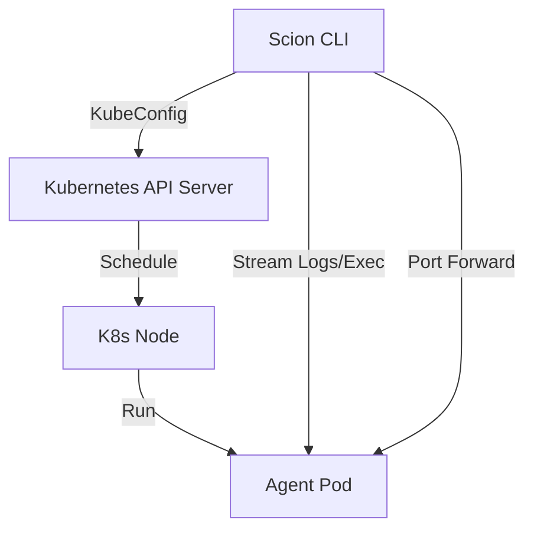

# Kubernetes Runtime Design

## Overview
This document outlines the design for adding a Kubernetes (K8s) runtime to the `scion-agent` CLI. This will allow agents to execute as Pods in a remote or local Kubernetes cluster, enabling scalability, resource management, and isolation superior to local Docker execution.

## Goals
- Allow `scion run` to execute agents in a Kubernetes cluster.
- Maintain a developer experience (DX) as close as possible to the local `docker` runtime.
- Support "Agent Sandbox" technologies for secure execution.
- Solve the challenges of remote file system access and user identity.
- Support a single 'grove' (project) utilizing a mix of local and remote agents.

## Architecture

The `scion` CLI will act as a Kubernetes client, interacting directly with the Kubernetes API (using `client-go`) to manage the lifecycle of agents.



## Key Challenges & Solutions

### 1. The Context Problem (Source Code & Workspace)
In the local `docker` runtime, we bind-mount the project directory. In K8s, the Pod is remote.

#### Solution: Snapshot & Sync (Copy-on-Start)
We will use a "Snapshot" approach for the MVP to align with the "run this task" mental model.
*   **Startup:**
    1.  Create Pod with an `EmptyDir` volume for `/workspace`.
    2.  Wait for Pod to be `Running`.
    3.  `tar` the local directory (respecting `.gitignore`) and stream it to the Pod:
        `tar -cz . | kubectl exec -i <pod> -- tar -xz -C /workspace`
    4.  Start the agent process.

#### Data Synchronization (Sync-Back)
Since the workspace is ephemeral, changes made by the agent must be explicitly retrieved.
*   **Manual Sync:** A new command `scion sync <agent-name>` will stream files from the Pod's `/workspace` back to the local directory.
*   **On Stop:** When `scion stop <agent-name>` is called, the CLI will prompt (or accept a flag `--sync`) to pull changes before destroying the Pod.
    *   *Mechanism:* `kubectl exec -i <pod> -- tar -cz -C /workspace . | tar -xz -C ./local/path`

### 2. The Identity Problem (Home Directory)
#### Solution: Hybrid Secret Projection
*   **Auth:** The CLI will auto-detect critical credentials (e.g., `~/.ssh/id_rsa`, `~/.config/gcloud`) and offer to create ephemeral K8s Secrets to mount them.
*   **Config:** Agents should be configured via environment variables or explicit config files rather than syncing a full home directory.

### 3. Security & Isolation (Agent Sandbox)
#### Solution: Runtime Classes
The `KubernetesRuntime` will support a `runtimeClassName` configuration. If configured (e.g., to `gvisor` or `kata`), the Pod spec will include this, enabling strong kernel-level isolation for untrusted code.

## Local Representation & State

Even though agents run remotely, their "handle" must remain local to maintain a consistent CLI experience.

### Directory Structure
We will retain the `.scion/agents/<agent-name>/` directory for every agent, regardless of runtime.
<!-- TODO this should be part of the agent structure in the json, which is read only -->
*   **`.scion/agents/<agent-name>/scion.json`**:
    *   **`runtime`**: `"kubernetes"`
    *   **`kubernetes`**:
        *   `cluster`: "my-cluster-context" (Snapshot of the context used to create it)
        *   `namespace`: "scion-agents"
        *   `podName`: "scion-agent-xyz-123"
        *   `syncedAt`: Timestamp of last sync.

### State Management
*   **Listing:** `scion list` will iterate through `.scion/agents/`. For K8s agents, it will perform a lightweight API check (e.g., `GetPod`) to update the status (Running/Completed/Error).
*   **Orphaned Pods:** If a local agent directory is deleted, the CLI should eventually allow "garbage collection" of managed Pods in the cluster via labels (`managed-by=scion`).

## Grove Configuration

<!-- TODO there is not a grove or project level scion.json
instead there should be an optional kubernetes-config.json
 -->
A "Grove" (the current project context) needs to define where its remote agents should live. This configuration belongs in the project's `scion.json`.

### Configuration Schema (`scion.json`)
<!-- TODO only keep the kuberentes specific fields in the kubernetes-config.json 
 -->
We will rely on the user's standard `~/.kube/config` for authentication and endpoint details, avoiding the need to manage sensitive credentials within Scion itself.

```json
{
  "template": "default",
  "image": "gemini-cli-sandbox",
  "runtime": "kubernetes", // Default runtime for this grove
  "kubernetes": {
    "context": "minikube",        // Optional: specific kubeconfig context to use
    "namespace": "scion-dev",     // Optional: target namespace (default: default)
    "runtimeClassName": "gvisor", // Optional: for sandboxing
    "resources": {                // Optional: default resource requests/limits
      "requests": { "cpu": "500m", "memory": "512Mi" },
      "limits": { "cpu": "2", "memory": "2Gi" }
    }
  }
}
```

### Hierarchy
1.  **Agent Config** (Runtime args): Overrides specific settings per agent.
2.  **Grove Config** (`scion.json`): Sets project-wide defaults (Cluster, Namespace).
<<!-- TODO  keep the kuberentes specific fields in the global ~/.scion/kubernetes-config.json  -->
3.  **Global Config** (`~/.config/scion/settings.json`): Sets user defaults (e.g., preferred default runtime).


## Implementation Plan

### New `KubernetesRuntime` Struct
Implement the `Runtime` interface in `pkg/runtime/kubernetes.go`.

```go
type KubernetesRuntime struct {
    Client      *kubernetes.Clientset
    Namespace   string
    Context     string // The kubeconfig context name
}
```

### Lifecycle Implementation
*   **Run:**
    1.  Load Grove config to determine Context/Namespace.
    2.  Init K8s Client.
    3.  Generate Pod Spec (Name: `scion-<agent-id>`, Label: `scion-agent=<agent-id>`).
    4.  Create Pod (EmptyDir for workspace).
    5.  Wait for `Running` state.
    6.  **Upload Context:** `tar` stream local dir -> Pod.
    7.  **Exec Start:** Run agent start command.
    8.  Update `.scion/agents/<id>/scion.json` with Pod details.
*   **Sync:** Implement `scion sync` using `tar` stream Pod -> local dir.
*   **Stop:**
    1.  (Optional) Prompt for Sync.
    2.  Delete Pod.
    3.  Clean up local `.scion/agents/<id>/` state.
*   **Attach:** Use `client-go/tools/remotecommand` with SPDY to attach to the main container's TTY.

## Future Work
*   **Sidecar Syncing:** Integrate with tools like Mutagen for real-time bidirectional syncing.
*   **Web Attach:** Provide a web-based gateway/proxy to attach to agents via browser.
*   **Job Mode:** Support running agents as K8s Jobs for finite, non-interactive tasks.